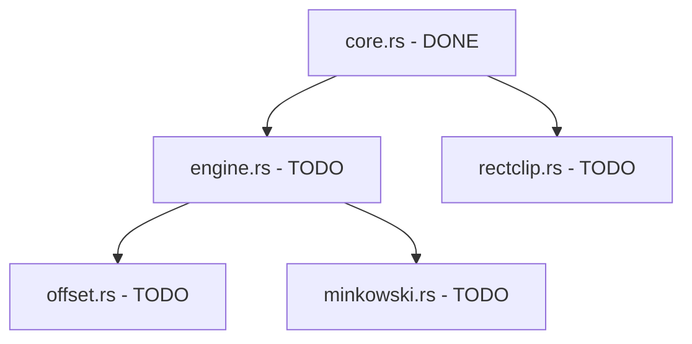

# CLIPPER2 RUST PORT - PROJECT STATUS

*Last Updated: 2025-09-18*

## 🎯 QUICK START FOR NEW SESSIONS

### Essential Commands to Run First
```bash
# Check current implementation status
python function_verifier.py

# Test current implementation
cargo test --lib

# Check database completeness
sqlite3 clipper2_complete.db "SELECT COUNT(*) as total_functions, SUM(rust_implemented) as implemented, SUM(rust_tested) as tested FROM functions;"
```

### Current Implementation Status
- **Total Functions**: 805 (database complete)
- **Implemented**: 53 functions (6.6%)
- **Tested**: 53 functions (6.6%) 
- **Remaining**: 752 functions

### What's Already Complete ✅
1. **Core Module** (`src/core.rs`) - **FULLY IMPLEMENTED**
   - All basic types: `Point<T>`, `Rect<T>`, `Path<T>`, `Paths<T>`
   - Fill rules, constants, error handling
   - Mathematical operations: cross product, dot product
   - Utility functions: bounds calculation, precision checking
   - **45 comprehensive tests passing**

2. **Version Module** (`src/version.rs`) - **FULLY IMPLEMENTED**
   - Version constants with tests

3. **Database Infrastructure** - **COMPLETE**
   - SQLite database with all 805 functions captured
   - Complete analysis of C++ codebase
   - Progress tracking system

## 🗂️ PROJECT STRUCTURE

### Key Files
```
C:\Development\clipper2-rust\
├── CLAUDE.md                    # STRICT IMPLEMENTATION RULES (READ FIRST!)
├── PROJECT_STATUS.md             # This file
├── IMPLEMENTATION_CHECKLIST.md  # Generated implementation checklist
├── clipper2_complete.db         # SQLite database with all functions
├── function_verifier.py         # Verification and reporting tool
├── src/
│   ├── lib.rs                   # Main library (only exports implemented modules)
│   ├── core.rs                  # Core types and functions (COMPLETE)
│   └── version.rs               # Version info (COMPLETE)
└── CPP/                         # Original C++ source code for reference
```

### Database Schema
```sql
-- Functions table tracks all 805 functions from C++ codebase
CREATE TABLE functions (
    name TEXT,
    filepath TEXT, 
    line_number INTEGER,
    signature TEXT,
    return_type TEXT,
    class_name TEXT,
    rust_implemented BOOLEAN DEFAULT FALSE,
    rust_tested BOOLEAN DEFAULT FALSE,
    -- ... other metadata fields
);

-- Files and classes tables for organization
CREATE TABLE files (...);
CREATE TABLE classes (...);
```

## 🚀 IMPLEMENTATION APPROACH

### Step-by-Step Process for New Sessions
1. **Run Status Check**: `python function_verifier.py`
2. **Identify Ready Functions**: Look for functions whose dependencies are already implemented
3. **Choose Implementation Target**: Pick from modules in dependency order:
   - ✅ `core.rs` (COMPLETE - 45 functions)
   - 🎯 `engine.rs` (Next priority - clipping engine)
   - 🎯 `offset.rs` (Path offsetting) 
   - 🎯 `rectclip.rs` (Rectangle clipping)
   - 🎯 `minkowski.rs` (Minkowski operations)

### Dependency Chain (Implementation Order)


## 🎯 NEXT PRIORITIES

### Ready for Implementation Now
Based on dependency analysis, these are likely ready:

1. **Simple Utility Functions** in core that might be missing
2. **Rectangle Clipping** (`rectclip.rs`) - Has minimal dependencies 
3. **Basic Engine Types** (constructors, simple methods)

### Query to Find Next Candidates
```sql
-- Find functions with no dependencies or minimal class dependencies
SELECT fn.name, fn.filepath, fn.line_number, fn.signature 
FROM functions fn 
JOIN files f ON fn.filepath = f.filepath 
WHERE fn.rust_implemented = 0 
    AND f.file_type = 'header'
    AND fn.class_name IS NOT NULL
ORDER BY fn.line_number 
LIMIT 20;
```

## ⚠️ CRITICAL RULES (FROM CLAUDE.md)

### ZERO TOLERANCE POLICY - NEVER VIOLATE THESE:
1. **NO `todo!()`, `unimplemented!()`, or `panic!()`** for missing functionality
2. **NO partial implementations** - function must be 100% complete
3. **NO implementation without dependencies** - all called functions must be implemented first
4. **COMPREHENSIVE testing required** - every function needs full test coverage
5. **EXACT behavioral matching** with C++ implementation

### Implementation Workflow
```
1. Dependency Check → 2. Full Implementation → 3. Comprehensive Tests → 4. Database Update
```

## 🔍 DEBUGGING & VERIFICATION

### Common Issues & Solutions
1. **Compilation Errors**: Usually trait bound issues - check `Num`, `Copy`, `PartialOrd`
2. **Test Failures**: Often precision/edge case issues - check C++ behavior exactly
3. **Database Sync**: After implementing functions, update database manually if needed

### Essential Test Commands
```bash
# Test specific module
cargo test core

# Test with pattern
cargo test get_bounds

# Run all tests
cargo test --lib
```

### Database Queries for Status
```sql
-- Implementation progress by file type
SELECT f.file_type, 
       COUNT(fn.id) as total,
       SUM(fn.rust_implemented) as implemented,
       printf("%.1f%%", SUM(fn.rust_implemented) * 100.0 / COUNT(fn.id)) as pct
FROM functions fn 
JOIN files f ON fn.filepath = f.filepath 
GROUP BY f.file_type;

-- Find functions ready for implementation
SELECT name, line_number FROM functions 
WHERE rust_implemented = 0 AND class_name IS NULL 
ORDER BY line_number LIMIT 10;
```

## 📊 DETAILED IMPLEMENTATION STATUS

### By Module
- **core.rs**: ✅ 45+ functions (Points, Rects, math utilities)
- **version.rs**: ✅ 1 function (version constant)
- **engine.rs**: ❌ Not started (main clipping algorithms)
- **offset.rs**: ❌ Not started (path offsetting)
- **rectclip.rs**: ❌ Not started (rectangle clipping)

### By Function Category
- **Basic Types**: ✅ Complete (Point, Rect, Path types)
- **Math Operations**: ✅ Complete (cross/dot product, bounds)
- **Utility Functions**: ✅ Mostly complete (precision, error handling)
- **Core Algorithms**: ❌ Not started (actual clipping logic)
- **Advanced Features**: ❌ Not started (offsetting, minkowski)

## 🎯 RECOMMENDED NEXT ACTIONS

### For Next Session - Choose One:
1. **Continue Core Utilities**: Look for any missing utility functions in core.h
2. **Start Rectangle Clipping**: Begin `rectclip.rs` module (simpler than engine)
3. **Begin Engine Types**: Start with basic data structures from engine.h

### Query to Run First in New Session:
```bash
# Get current status and find next candidates
python function_verifier.py

# Check what's ready for rectclip module
grep -n "class.*Rect.*Clip" CPP/Clipper2Lib/include/clipper2/clipper.rectclip.h
```

## 💡 LESSONS LEARNED

### Implementation Insights
1. **GetBounds Functions**: Successfully implemented with comprehensive testing
2. **Template Functions**: Handle with generic `<T>` bounds carefully
3. **Precision Issues**: f32→f64 conversion needs larger tolerances
4. **Edge Cases**: Empty paths, identical points need special handling

### Best Practices Established
1. **Always check dependencies first** - prevents wasted effort
2. **Implement tests immediately** - catches issues early
3. **Match C++ behavior exactly** - including edge cases
4. **Use comprehensive error checking** - better than C++ often

---

**🚀 Ready to continue implementation! Next session can start immediately with the status commands above.**