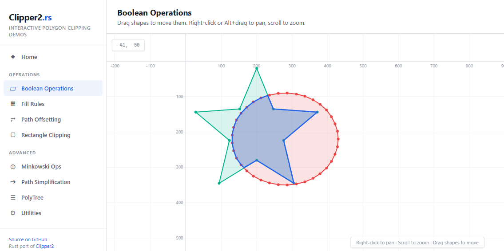

# Clipper2 Rust

A Polygon <a href="https://en.wikipedia.org/wiki/Clipping_(computer_graphics)">Clipping</a> and <a href="https://en.wikipedia.org/wiki/Parallel_curve">Offsetting</a> library — a complete, pure Rust port of the [Clipper2 C++ library](https://github.com/AngusJohnson/Clipper2) by [Angus Johnson](https://www.angusj.com).

[](https://crates.io/crates/clipper2-rust)
[](https://docs.rs/clipper2-rust)
[](https://www.boost.org/LICENSE_1_0.txt)
[](https://larsbrubaker.github.io/clipper2-rust/)

## Interactive Demo

**[Try it in your browser — no installation required](https://larsbrubaker.github.io/clipper2-rust/)**

[](https://larsbrubaker.github.io/clipper2-rust/)

8 interactive pages running entirely via WebAssembly: boolean operations, fill rules, path offsetting, rectangle clipping, Minkowski operations, path simplification, PolyTree visualization, and utilities. All shapes are draggable for real-time exploration.

## Status: Complete

This port is **feature-complete** — all core algorithms have been ported and verified against the original C++ implementation.

- **444 tests** (392 unit + 52 integration), all passing, 0 ignored
- **Exact behavioral match** with C++ on all test cases, including edge cases from 20+ GitHub issues
- **4 examples** demonstrating clipping, offsetting, rectangle clipping, and benchmarking
- **6 Criterion benchmarks** covering boolean ops, offsetting, rect clipping, and simplification

## Overview

The **Clipper2** library performs **intersection**, **union**, **difference** and **XOR** boolean operations on both simple and complex polygons. It also performs polygon **offsetting/inflating**.

This is a pure Rust port of the original [Clipper2 C++ library](https://github.com/AngusJohnson/Clipper2), with identical functionality, algorithmic behavior, and precision while leveraging Rust's memory safety guarantees.

This port was created by [MatterHackers](https://www.matterhackers.com) using [Claude](https://www.anthropic.com/claude) by Anthropic.

## Features

- **Boolean Operations**: Intersection, Union, Difference, XOR on both simple and complex polygons
- **Polygon Offsetting**: Inflate/deflate polygons with Miter, Square, Bevel, and Round join types
- **Rectangle Clipping**: High-performance rectangular clipping
- **Minkowski Sum/Difference**: Geometric Minkowski operations on polygons
- **Path Simplification**: Reduce polygon complexity while preserving shape (Ramer-Douglas-Peucker)
- **Multiple Precision**: Integer (`i64`) and floating-point (`f64`) coordinate support
- **PolyTree Structure**: Hierarchical representation of polygon parent/child/hole relationships
- **SVG Output**: Built-in SVG writer for visualization and debugging
- **100% Safe Rust**: Zero `unsafe` blocks — enforced at compile time with `#![forbid(unsafe_code)]`

## Visual Examples

**Clipping**


**Inflating (aka Offsetting)**


## Documentation

Comprehensive documentation for the Clipper2 algorithms and API is available at:

<a href="https://www.angusj.com/clipper2/Docs/Overview.htm"><b>Clipper2 Documentation</b></a>

The Rust API follows the same structure and naming conventions (adapted to Rust idioms) as the original C++ library, so the upstream documentation serves as an excellent reference.

## Installation

This library is available on [crates.io](https://crates.io/crates/clipper2-rust).

## Quick Start

Add this to your `Cargo.toml`:

```toml
[dependencies]
clipper2-rust = "1.0"
```

### Boolean Operations

```rust
use clipper2_rust::core::FillRule;

let subject = vec![clipper2_rust::make_path64(&[100, 100, 300, 100, 300, 300, 100, 300])];
let clip = vec![clipper2_rust::make_path64(&[200, 200, 400, 200, 400, 400, 200, 400])];

let intersection = clipper2_rust::intersect_64(&subject, &clip, FillRule::NonZero);
let union = clipper2_rust::union_64(&subject, &clip, FillRule::NonZero);
let difference = clipper2_rust::difference_64(&subject, &clip, FillRule::NonZero);
let xor = clipper2_rust::xor_64(&subject, &clip, FillRule::NonZero);
```

### Polygon Offsetting

```rust
use clipper2_rust::offset::{JoinType, EndType};

let paths = vec![clipper2_rust::make_path64(&[0, 0, 100, 0, 100, 100, 0, 100])];
let inflated = clipper2_rust::inflate_paths_64(&paths, 10.0, JoinType::Round, EndType::Polygon, 2.0, 0.0);
```

### Rectangle Clipping

```rust
use clipper2_rust::core::Rect64;

let rect = Rect64::new(100, 100, 300, 300);
let paths = vec![clipper2_rust::make_path64(&[50, 50, 350, 50, 350, 350, 50, 350])];
let clipped = clipper2_rust::rect_clip_64(&rect, &paths);
```

## Architecture

### Coordinate Systems

The library supports two coordinate systems:

- **`Path64`/`Paths64`**: Integer coordinates using `i64` — recommended for precision
- **`PathD`/`PathsD`**: Floating-point coordinates using `f64` — convenient for external data

### Key Types

```rust
// Points
pub struct Point64 { pub x: i64, pub y: i64 }
pub struct PointD { pub x: f64, pub y: f64 }

// Paths (polygons)
pub type Path64 = Vec<Point64>;
pub type PathD = Vec<PointD>;
pub type Paths64 = Vec<Path64>;
pub type PathsD = Vec<PathD>;

// Rectangles
pub struct Rect64 { pub left: i64, pub top: i64, pub right: i64, pub bottom: i64 }
pub struct RectD { pub left: f64, pub top: f64, pub right: f64, pub bottom: f64 }
```

## Examples

Run the included examples:

```bash
cargo run --example simple_clipping    # Boolean intersection with SVG output
cargo run --example inflate_paths      # Path offsetting demo
cargo run --example rect_clipping      # Rectangle clipping demo
cargo run --example benchmark_cli      # Performance benchmark
```

## Development

### Prerequisites

- Rust 1.70+ (2021 edition)

### Building

```bash
cargo build
```

### Testing

```bash
cargo test                          # All 444 tests
cargo test --lib core_tests         # Specific module
cargo test test_name -- --exact     # Specific test
```

### Benchmarking

```bash
cargo bench
```

## Contributing

Contributions are welcome! Please note:

1. All functions must be **complete** — no `todo!()` or stubs
2. Tests required for all new functionality
3. Must match C++ behavioral semantics for ported code
4. Run `cargo test` and `cargo clippy` before submitting

## License

This project is licensed under the [Boost Software License 1.0](https://www.boost.org/LICENSE_1_0.txt), the same license as the original Clipper2 C++ library.

## Acknowledgments

- **[Angus Johnson](https://www.angusj.com)** — Author of the original [Clipper2](https://github.com/AngusJohnson/Clipper2) library
- **[MatterHackers](https://www.matterhackers.com)** — Developed this Rust port
- **[Claude](https://www.anthropic.com/claude) by Anthropic** — AI assistant used to perform the port
