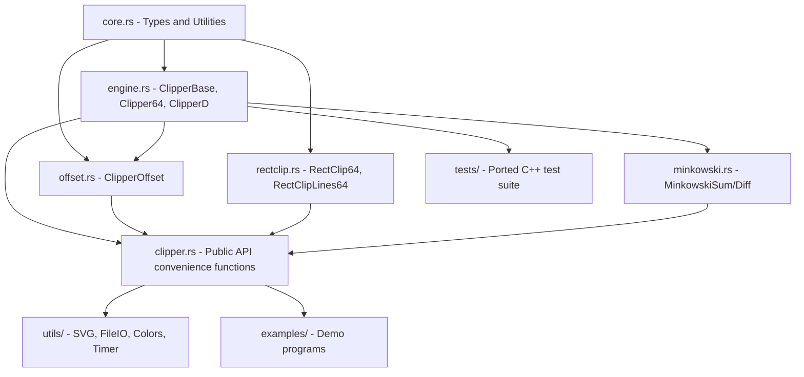

# Clipper2 Full Rust Port Plan

## Current State

- **Completed**: `core.rs` (~40 functions, types, enums), `version.rs`, partially simplified `rectclip.rs`
- **Remaining**: ~5,750+ lines of C++ library code + utilities/examples/tests to port
- **Key issue**: Current `rectclip.rs` uses Sutherland-Hodgman algorithm instead of the C++ OutPt2-based algorithm -- must be rewritten

## Architecture Overview




## Implementation Phases (Strict Dependency Order)

### Phase 1: Complete Missing core.rs Functions

**C++ source**: `clipper.core.h` lines 405-1044
**Target file**: [src/core.rs](src/core.rs)

Missing functions to add (~13 functions, ~16 signatures):

- `scale_path()`, `scale_paths()` -- scale with type conversion and error handling
- `scale_rect()` -- scale rectangle with type conversion
- `transform_path()`, `transform_paths()` -- type conversion between Path types
- `near_equal()` -- point proximity check with distance threshold
- `strip_near_equal()`, `strip_near_equal_paths()` -- remove near-duplicate points
- `translate_point()`, `reflect_point()` -- point transformations
- `get_sign()` -- generic sign function
- `segments_intersect()` -- boolean segment intersection test
- `get_closest_point_on_segment()` -- closest point projection
- `cross_product_sign()` -- high-precision cross product sign (-1, 0, 1)

Each function needs comprehensive tests in [src/core_tests.rs](src/core_tests.rs).

### Phase 2: Rewrite rectclip.rs (Exact C++ Port)

**C++ source**: `clipper.rectclip.h` (80 lines) + `clipper.rectclip.cpp` (1,027 lines)
**Target file**: [src/rectclip.rs](src/rectclip.rs) (complete rewrite)

The current Rust implementation uses a simplified Sutherland-Hodgman approach that does NOT match C++behavior. Must rewrite to match the C++ algorithm:

- Add `OutPt2` struct (doubly-linked list node with owner index and edge pointer)
- Rewrite `RectClip64` with proper internal state:
  - `path_bounds_: Rect64`
  - `op_container_: VecDeque<OutPt2>` (arena allocator equivalent)
  - `results_: Vec<*mut OutPt2>`
  - `edges_: [Vec<*mut OutPt2>; 8]` (8 edge lists)
  - `start_locs_: Vec<Location>`
- Port all 19 helper functions and 9 class methods exactly
- `RectClipLines64` shares base with `RectClip64` (use composition in Rust since no inheritance)
- Port all 3 RectClipLines64 methods

### Phase 3: Engine Module - Data Structures

**C++ source**: `clipper.engine.h` lines 1-170
**Target file**: New `src/engine.rs`

Structs to implement:

- `Vertex` -- input polygon vertex (circular doubly-linked list)
- `Active` -- active edge in sweep line (with raw pointers or arena indices)
- `OutPt` -- output point (circular doubly-linked list)
- `OutRec` -- output polygon record
- `LocalMinima` -- local minimum vertex
- `IntersectNode` -- edge intersection record
- `HorzSegment`, `HorzJoin` -- horizontal edge processing

Enums to implement:

- `ClipType` (NoClip, Intersection, Union, Difference, Xor)
- `PathType` (Subject, Clip)
- `JoinWith` (NoJoin, Left, Right)
- `VertexFlags` (bitflags: Empty, OpenStart, OpenEnd, LocalMax, LocalMin)

**Design decision**: The C++uses raw pointers extensively for linked lists. In Rust, use an arena-based approach (Vec as arena with indices) or `unsafe` raw pointers to match C++ performance. Arena indices are safer; raw pointers are more faithful to C++.

### Phase 4: Engine Module - Free Functions

**C++ source**: `clipper.engine.cpp` lines 1-1220 (roughly)
**Target file**: `src/engine.rs`

~50 standalone utility functions including:

- Edge queries: `is_odd`, `is_hot_edge`, `is_open`, `is_open_end`, `is_front`, `is_horizontal`, `is_maxima`, `is_joined`
- Navigation: `next_vertex`, `prev_prev_vertex`, `get_maxima_pair`, `get_curr_y_maxima_vertex`
- AEL operations: `swap_actives`, `insert_right_edge`, `is_valid_ael_order`
- OutPt operations: `point_count`, `duplicate_op`, `dispose_out_pt`, `set_sides`, `swap_sides`, `swap_outrecs`
- Path building: `get_clean_path`, `build_path64`, `build_path_d`
- Input processing: `add_loc_min`, `add_paths_` (shared path-to-vertex conversion)

### Phase 5: Engine Module - ClipperBase

**C++ source**: `clipper.engine.h` lines 192-289, `clipper.engine.cpp` lines 1220-3161
**Target file**: `src/engine.rs`

ClipperBase struct with ~50 methods. Key methods by algorithm phase:

1. **Input processing**: `add_path`, `add_paths`, `clear`, `reset`
2. **Main sweep loop** (`execute_internal`):
  - `insert_local_minima_into_ael` -- create Active edges from local minima
  - `do_horizontal` -- process horizontal edges (~170 lines)
  - `do_intersections` / `build_intersect_list` / `process_intersect_list` -- find and handle intersections
  - `do_top_of_scanbeam` -- advance edges to next scanline
3. **Edge operations**: `intersect_edges` (~315 lines, core logic), `swap_positions_in_ael`, `delete_from_ael`, `update_edge_into_ael`
4. **Output building**: `add_out_pt`, `add_local_min_poly`, `add_local_max_poly`, `join_outrec_paths`
5. **Post-processing**: `clean_collinear`, `fix_self_intersects`, `do_split_op`, `recursive_check_owners`
6. **Horizontal joins**: `convert_horz_segs_to_joins`, `process_horz_joins`, `add_trial_horz_join`

### Phase 6: Engine Module - Clipper64, ClipperD, PolyPath

**C++ source**: `clipper.engine.h` lines 298-631
**Target file**: `src/engine.rs`

- `ReuseableDataContainer64` -- reusable vertex/minima data
- `PolyPath` trait (base class equivalent)
- `PolyPath64` -- integer coordinate poly tree node
- `PolyPathD` -- double coordinate poly tree node
- `Clipper64` -- public 64-bit integer clipper (wraps ClipperBase)
  - `add_subject`, `add_open_subject`, `add_clip`
  - `execute` (4 overloads)
  - `build_paths64`, `build_tree64`
- `ClipperD` -- public double-precision clipper
  - Scale conversion (PathsD -> Paths64 -> PathsD)
  - `build_paths_d`, `build_tree_d`

### Phase 7: Offset Module

**C++ source**: `clipper.offset.h` (125 lines) + `clipper.offset.cpp` (661 lines)
**Target file**: New `src/offset.rs`

- `JoinType` enum (Square, Bevel, Round, Miter)
- `EndType` enum (Polygon, Joined, Butt, Square, Round)
- `ClipperOffset::Group` struct
- `ClipperOffset` struct with:
  - `add_path`, `add_paths`, `clear`
  - `execute` (3 overloads: to Paths64, to PolyTree64, with DeltaCallback)
  - Internal: `build_normals`, `do_bevel`, `do_square`, `do_miter`, `do_round`
  - Internal: `offset_point`, `offset_polygon`, `offset_open_joined`, `offset_open_path`
  - Internal: `do_group_offset`, `execute_internal`
- Helper functions: `get_unit_normal`, `normalize_vector`, `get_perpendic`, etc.
- **Depends on**: engine module (uses Clipper64 for union in ExecuteInternal)

### Phase 8: Minkowski Module

**C++ source**: `clipper.minkowski.h` (117 lines, header-only)
**Target file**: New `src/minkowski.rs`

- `minkowski_sum()` (Path64 and PathD overloads)
- `minkowski_diff()` (Path64 and PathD overloads)
- Internal `minkowski()` helper
- **Depends on**: engine module (uses union operation)

### Phase 9: Public API (clipper.h Convenience Functions)

**C++ source**: `clipper.h` (795 lines)
**Target file**: New `src/clipper.rs` or extend `src/lib.rs`

Convenience functions wrapping the engine/offset/rectclip:

- Boolean ops: `boolean_op`, `intersect`, `union_op`, `difference`, `xor_op` (Paths64 and PathsD overloads)
- Offsetting: `inflate_paths` (Paths64 and PathsD)
- Rect clipping: `rect_clip`, `rect_clip_lines` (convenience wrappers)
- Path construction: `make_path`, `make_path_d`
- Path simplification: `trim_collinear`, `simplify_path`, `simplify_paths`, `ramer_douglas_peucker`
- Geometric utilities: `distance`, `length`, `near_collinear`, `ellipse`
- Translation: `translate_path`, `translate_paths`
- PolyTree conversion: `poly_tree_to_paths64`, `poly_tree_to_paths_d`

### Phase 10: Utilities

**Target directory**: New `src/utils/` module

- **SVG output** (`clipper.svg.h`/`.cpp`): `SvgWriter`, `SvgReader` for visualization
- **File I/O** (`ClipFileLoad.h`/`.cpp`, `ClipFileSave.cpp`): Test data loading/saving
- **Colors** (`Colors.h`): HSL color utilities
- **Timer** (`Timer.h`): Performance timing

### Phase 11: Port C++ Tests

**C++ source**: `CPP/Tests/` (14 test files)
**Target**: Rust integration tests or extend existing test modules

Port all C++ test cases:

- `TestIsCollinear`, `TestLines`, `TestOffsetOrientation`, `TestOffsets`
- `TestOrientation`, `TestPolytreeHoles`, `TestPolytreeUnion`
- `TestRandomPaths`, `TestRect`, `TestRectClip`
- `TestSimplifyPath`, `TestTrimCollinear`
- Memory leak test (less relevant in Rust but ensure no leaks with arena)

### Phase 12: Examples and Benchmarks

**Target**: `examples/` directory and `benches/`

- Port C++ examples as Rust examples (SimpleClipping, RandomClipping, Inflate, etc.)
- Expand benchmark suite beyond current `clipper_bench.rs`

## Key Design Decisions for Rust

- **Linked lists**: Use arena allocation (`Vec<Node>` with indices) instead of raw pointers where possible. Consider `unsafe` blocks only where performance-critical and arena indices add overhead.
- **Inheritance**: C++ uses inheritance (ClipperBase -> Clipper64, RectClip64 -> RectClipLines64). Use composition + traits in Rust.
- **Templates**: C++ templates become Rust generics with trait bounds (already done for Point/Rect/Path).
- **USINGZ**: Support Z coordinates via a Cargo feature flag (`features = ["usingz"]`).
- **Error handling**: Use `Result<T, Clipper2Error>` instead of error codes where idiomatic, but maintain compatibility with C++ behavior.

## File Organization

```
src/
  lib.rs          -- Module declarations and re-exports
  core.rs         -- Core types and utilities (exists, needs ~13 more functions)
  core_tests.rs   -- Core tests (exists, needs expansion)
  engine.rs       -- NEW: ClipperBase, Clipper64, ClipperD, PolyPath types
  engine_tests.rs -- NEW: Engine tests
  rectclip.rs     -- REWRITE: Exact C++ port with OutPt2
  rectclip_tests.rs -- REWRITE: Tests for exact port
  offset.rs       -- NEW: ClipperOffset
  offset_tests.rs -- NEW: Offset tests
  minkowski.rs    -- NEW: Minkowski operations
  clipper.rs      -- NEW: Public API convenience functions
  utils/
    mod.rs        -- Utility module
    svg.rs        -- SVG writer/reader
    file_io.rs    -- Test file loading/saving
    colors.rs     -- Color utilities
    timer.rs      -- Timing utilities
  version.rs      -- Version constants (exists)
examples/
  simple_clipping.rs
  random_clipping.rs
  inflate.rs
  rect_clipping.rs
  union_clipping.rs
  polygon_samples.rs
  using_z.rs
  variable_offset.rs
benches/
  clipper_bench.rs  -- (exists, expand)
```

